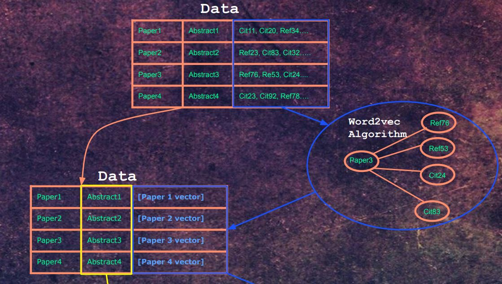
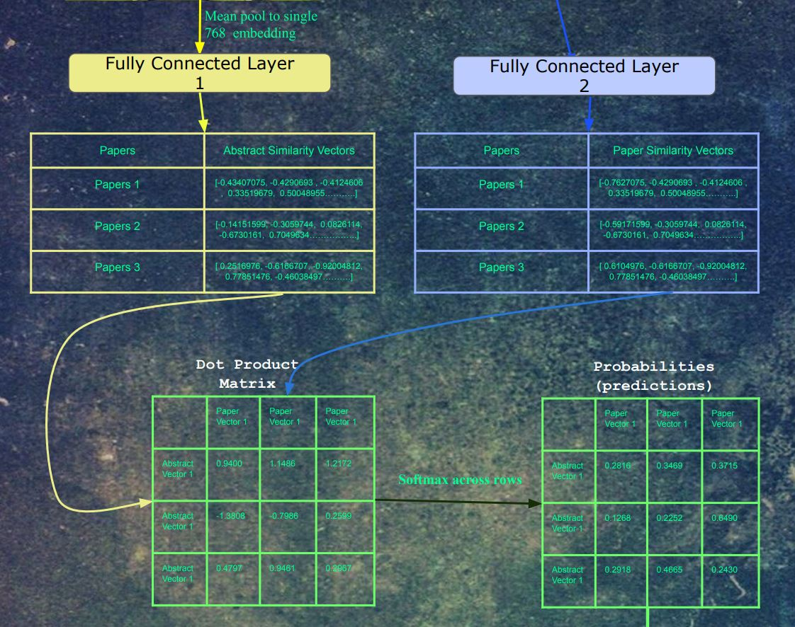
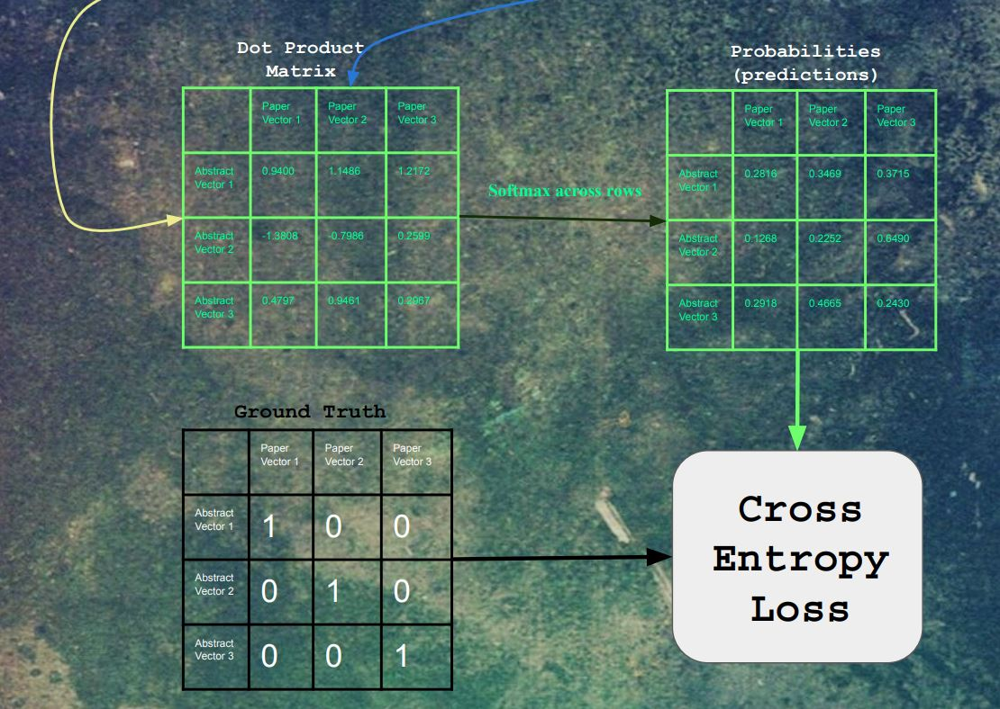

[](http://hits.dwyl.io/Santosh-Gupta/NaturalLanguageRecommendations)

# Natural Language Recommendations : A novel research paper search engine developed entirely with embedding and transformer models. 

<p align="center">
  
</p>

### Architecture 

<p align="center">
  
</p>

The architecture is one part word2vec, one part Bert as a text encoder. I previously explored Bert medical text encodings in a previous project [https://github.com/re-search/DocProduct] and was impressed by the effectiveness at correlating medical questions with answers. In this project, we use the abstract of each paper as the input, but instead of using another Bert encoding as a label, we use a vector that was trained using word2vec. The Semantic Scholar Corpus [https://api.semanticscholar.org/corpus/] contains 179 million papers, and for each paper, it has the paper IDs of papers that it either cited, or papers that referenced that paper. 

This network of citations can be trained on using the word2vec algorithm. Each embedding represents a paper. For each paper, it's citations and embeddings act as the 'context'. 


<p align="center">
  
</p>

Our word2vec training notebooks can be found here https://github.com/Santosh-Gupta/NaturalLanguageRecommendations/tree/master/notebooks/training

Next, the abstracts are fed into Bert. The embeddings for the last hidden layer and mean pooled into a single 768 dimensional vector. This vector and then fed into a fully connected layer, whose output is a 512 dimensional vector. At the same time, each paper's paper vector is fed into a seperate fully connected layer, whose output is 512 dimensions. We picked 512 as the embedding size in word2vec because in the literature on word embeddings, sometimes the embedding quality decreases after 512 dimensions, so we picked the highest dimension possible (to closer to Bert's 768 hidden layer dimensions) without risk of decreasing the quality of the embeddings. There isn't too much confidence in this choice, as the distributions in the paper data are quite different from words in text. Regular word2vec training contains 5-6 figures of labels, a lot of which frequenctly occur throughout the data. The paper data has  7-8 figures of labels, which each label occuring much less frequently. 


<p align="center">
  
</p>

The notebook that we used to convert the abstracts to bert input ids, and make a dataset with the input ids and paper vectors to tfrecords files can be found here 

https://github.com/Santosh-Gupta/NaturalLanguageRecommendations/blob/master/notebooks/data/CreateCS_tfrecordsDataSet4Bert_github.ipynb

We wanted to use negative sampling in our training, so in each batch, all of the labels can act as negative labels for training examples that they do not belong to. This is tricky to do, because we wanted the samples to be chosen at random, but our data was split up into multiple files, with only a few at a time being loaded into memory due to our dataset being too large to fit the whole thing into ram. Luckily, the tf.data api made this really easy to do. 

```
with strategy.scope():
    train_files = tf.data.Dataset.list_files(tfrecords_pattern_train)
    train_dataset = train_files.interleave(tf.data.TFRecordDataset,
                                           cycle_length=32,
                                           block_length=4,
                                           num_parallel_calls=autotune)
    train_dataset = train_dataset.map(parse_example, num_parallel_calls=autotune)
    train_dataset = train_dataset.batch(batch_size, drop_remainder=True)
    train_dataset = train_dataset.repeat()
    train_dataset = train_dataset.prefetch(autotune)

    val_files = tf.data.Dataset.list_files(tfrecords_pattern_val)
    val_dataset = val_files.interleave(tf.data.TFRecordDataset,
                                       cycle_length=32,
                                       block_length=4,
                                       num_parallel_calls=autotune)
    val_dataset = val_dataset.map(parse_example, num_parallel_calls=autotune)
    val_dataset = val_dataset.batch(batch_size, drop_remainder=True)
    val_dataset = val_dataset.repeat()
    val_dataset = val_dataset.prefetch(autotune)

tf.data.experimental.get_structure(train_dataset), tf.data.experimental.get_structure(val_dataset)
```

<p align="center">
  
</p>

Another challenge we ran into is the training time for the data. We were developing this project for the TFWorld hackathon [https://tfworld.devpost.com/] whose deadline was dec 31st, but we had only finished processing the data a few days before. We had 1.26 million training example, and our architecture contained a whole Bert model, which is Not super fast to train on. Luckily, we has access to TPUs, which were ultrafast, **1 epoch taking 20-30 minutes each!**. Not only were we able to run several hyperparameter experiments on the data before the deadline. 

```
try:
    tpu = tf.distribute.cluster_resolver.TPUClusterResolver('srihari-1-tpu')  # TPU detection
    print('Running on TPU ', tpu.cluster_spec().as_dict()['worker'])
except ValueError:
    tpu = None

if tpu:
    tf.config.experimental_connect_to_cluster(tpu)
    tf.tpu.experimental.initialize_tpu_system(tpu)
    strategy = tf.distribute.experimental.TPUStrategy(tpu)
```

```
with strategy.scope():
    train_files = tf.data.Dataset.list_files(tfrecords_pattern_train)
```

```
with strategy.scope():
    model = create_model(drop_out=0.20)
    model.compile(loss=loss_fn,
                  optimizer=tf.keras.optimizers.Adam(learning_rate=3e-5))
```


The really fun part was using Tensorboard, which allows users to see training and results in real time. 

https://tensorboard.dev/experiment/rPYkizsLTWOpua3cyePkIg/#scalars

https://tensorboard.dev/experiment/dE1MpRHvSd2XMltMrwqbeA/#scalars

<p align="center">
  
</p>

A link to the model training notebook can be found here 

https://github.com/Santosh-Gupta/NaturalLanguageRecommendations/blob/master/notebooks/training/model.ipynb

Watching the first Tensorboard training was like watching a NASA launch. At the time of the first training, we spent nearly 2 months on the project. There was some worry that the data may not train well. There may have been something wrong with the data. Maybe we picked the wrong hyperparameters, etc. We all sat around, nerviously waiting for each 20 minute epoch increment, hoping the loss would go do. And then it did. And then it did again, and again. And again. 

After the embeddings pass through the fully connected layers, the resulting embeddings are all dot product'd with each other. For each paper, a softmax was taken for each of it's dot products. Finally, cross-entropy loss was performed on these logits, with a label of 1 for each original input/output pair for that training example, and 0 for all other combinations. 

<p align="center">
  
</p>

### Paper Data
The papers used for this project were cleaned from Semantic Scholar's Open Corpus. 
Link to the cleaned data used: https://drive.google.com/open?id=1PcdLDJUXoVXorlCTcGlM98GllArk5Z9s

### Our Amazing Chaotic Journey (How we did it)

#### Step 1: Filter the Semantic Scholar Corpus

The Semantic Scholar Corpus contains about 178 million papers in a variety of subjects. We don't have the computer power to process the whole dataset (yet, if you know anything about model parallelism, please contact us), so we're focusing on subsets of the corpus. 

We developed filters to distil CS/Math/Physics papers from the copus here (warning, huge notebook)

https://github.com/Santosh-Gupta/NaturalLanguageRecommendations/blob/master/notebooks/text2cite_preprocessing.ipynb

And we are currently working on a subset that contains only Medline/Pubmed papers

https://github.com/Santosh-Gupta/NaturalLanguageRecommendations/blob/master/notebooks/medical_preprocessing.ipynb

Our filtering isn't pefect, and there are papers that shouldn't be in our subsets, that aren't. 

#### Step 2: Pruning, and creating embeddings dataset

Each paper has a list of references and citations. We only want papers that have a citations or references to one of the other papers in our dataset (otherwise its embedding will never get a chance to be trained in word2vec), so we prune out those papers. Next, we map a unique embedding ID for each paper, save the citation data, and create a HDF5 dataset to be used for word2vec training. 

https://github.com/Santosh-Gupta/NaturalLanguageRecommendations/blob/master/notebooks/data/PruningCreateEmbeddingDataGithub.ipynb

#### Step 3: Word2vec

We apply word2vec training to the citation/reference network data. The 'context' for each paper will be 4 of its reference/citation papers chosen at random. The issue with training an embedding for each paper is that we have a lot of papers. Our CS dataset contains 1.26 million papers (where as word embedding training is usually in 5-6 figures only), and our Medline/Pubmed dataset contains 15 million papers. 

We were looking into model parallelism at the time, but with the deadline coming up, we decided to use SpeedTorch. Although we still have a TF2.0 version of Word2Vec implemented in keras, [here](https://github.com/Santosh-Gupta/NaturalLanguageRecommendations/blob/master/notebooks/training/TF2.0%20Word2Vec%20CBOW.ipynb).

https://github.com/Santosh-Gupta/SpeedTorch

A library to increase transfer between CPU<->GPU. We used this to host some of the embeddings on the CPU whenever they weren't being trained. 

https://github.com/Santosh-Gupta/NaturalLanguageRecommendations/blob/master/notebooks/training/PaperVectorTrainingWord2vec_Github.ipynb

#### Step 4: Create Bert Dataset.

After word2vec training, we have a citation embedding which represents each paper. We can then use this vector as a label for the mean-pooled output of the last hidden states of Bert, with the input being each paper's abstract. We used the SciBert vocab for the tokenizer since SciBert was actually trained on many of the papers in the Semantic Scholar Corpus. 

https://github.com/allenai/scibert

https://github.com/Santosh-Gupta/NaturalLanguageRecommendations/blob/master/notebooks/data/CreateCS_tfrecordsDataSet4Bert_github.ipynb

We saved these files to tfrecords file type, which works great with the tf.data api and TPU training. 

https://www.tensorflow.org/tutorials/load_data/tfrecord

#### Step 5: Training Bert

Using the dataset created in Step 4, we can train our Bert model, and our similarity fully connected layers. Please see the architecture section for more details. We used the TF2.0 Keras version of HuggingFace's transformer library for Bert. 

https://github.com/huggingface/transformers

And we used Keras for the overall architecture as well. The initial weights we used were SciBert weights. https://github.com/allenai/scibert . 

We used tf.data to handle our data pipeline, and we used TPUv3-8 provided by the TensorFlow Research Cloud to train over our data.

https://github.com/Santosh-Gupta/NaturalLanguageRecommendations/blob/master/notebooks/model.ipynb

#### Step 6: Inference

We plan to eventually run inference on all 179 million papers on the Semantic Scholar Corpus, which is a ton of papers to run similarity search on.  So one of the members,  Srihari created a new library for running similarity search over large numbers of embeddings **over a TPU**!. We chose to do this on TPUs for their speed and memory capacity.  Currently, the package supports search using cosine similarity, but we plan to extend this to multiple distance metrics. The package is quite simple to use, here is a quick way to get started!
```
from tpu_index import TPUIndex

index = TPUIndex(num_tpu_cores=8)
index.create_index(vectors)  # vectors = numpy array, shape == [None, None]

...
D, I = index.search(xq, distance_metric='cosine', top_k=5)
```

Check it out 

https://github.com/srihari-humbarwadi/tpu_index

https://pypi.org/project/tpu-index/


## Some initial success

It was recently found by one of our members a perfect example of how our solution compares to an established one such the Semantic Sholar Corpus. For this [paper](https://www.semanticscholar.org/paper/Job-Prediction%3A-From-Deep-Neural-Network-Models-to-Huynh-Nguyen/f96cae24d992d7bcd44a99baa2ecd80e713271cc#related-papers). Titled: Job Prediction: From Deep Neural Network Models to Applications
Which the Sematic Scholar gives these three papers as 'Relevant Papers':

<p align="center">
  
</p>

And our model was able to find:
<p align="center">
  
</p>

Although our model also shows non-relevant results to using machine learning in job matching and modeling this does show the capibilities of our model in being able to find rarer or more obscure papers that have less academic papers written on the subject.

### Unfinished Business (future work)

#### Metrics

Judging the results just qualitativly. . . they're really really *Really* Good. (But don't take our word for it, try it out. We have [colab notebooks](https://github.com/Santosh-Gupta/NaturalLanguageRecommendations/tree/master/notebooks/inference) that downloads the model and the data within a few clicks, and you can use it to search papers in CS). We are looking for ways to give our qualitative experiences quantitative metrics. If you have any ideas, please contact us at Research2vec@gmail.com .

#### Model Variations 

We have gained quite a bit of insight during this project, and have ideas of what may further improve the quality of the results. We have quite a few ideas on variations on our model which we are curious to test out. 

#### Bigger/Better Subsets

Since the Semantic Scholar corpus is so large, we can only test subsets of subjects at a time, but there's not a way currently to filter out a certain subset directly, so we have to get creative on how we create our subsets. We are hoping to improve upon our filtering methods to get more specific/accurate subsets from the corpus. 

We are also hoping to figure out ways to increase the number of parameters we can train word2vec on. Currently, our capacity is around 15 million. We are aiming to get up to 179 million, which would take up a ton of memory (200 gb?) to have them all loaded into memory at the same time. If you have any ideas for this, please get in touch. 

#### Paper

We are also looking to perform experiments and write up our work in a high enough level of quality that would make a significant contribution to the field of NLP, and thus qualify for getting accepted into a prestigiouos venue/journal. We are also looking for mentors who have accomplished this. If interested, please contact us at the email posted above.


### Notebooks
#### [build_index_and_search.ipynb](https://github.com/Santosh-Gupta/NaturalLanguageRecommendations/blob/master/notebooks/inference/build_index_and_search.ipynb)
Description: This notebook loads the trained bert model, builds the index with 1.3 million papers on TPUs and runs a demo search.

#### [tpu_index_search_million_embeddings.ipynb](https://github.com/Santosh-Gupta/NaturalLanguageRecommendations/blob/master/notebooks/inference/tpu_index_search_million_embeddings.ipynb)
Description: A demo notebook showcasing our tpu_index package running search on a million abstract embeddings from BERT model.

#### [create_abstract_vectors.ipynb](https://github.com/Santosh-Gupta/NaturalLanguageRecommendations/blob/master/notebooks/create_abstract_vectors.ipynb)
Description: This notebook extracts embeddings for paper abstracts by passing them through the BERT model.

#### [inference_model.ipynb](https://github.com/Santosh-Gupta/NaturalLanguageRecommendations/blob/master/notebooks/inference_model.ipynb)
Description: This notebook builds the models for inference phase.

#### [medical_preprocessing.ipynb](https://github.com/Santosh-Gupta/NaturalLanguageRecommendations/blob/master/notebooks/medical_preprocessing.ipynb)
Description: This notebook was used to clean the original Open Corpus dataset to retain all papers that either had a PubMed id or were part of MedLine and had at least 1 citation. Cleaned medical data in folder linked above.

#### [model.ipynb](https://github.com/Santosh-Gupta/NaturalLanguageRecommendations/blob/master/notebooks/model.ipynb)
Description: This notebook has the training code for BERT, which is designed to run on Google Cloud TPU v3-8.

#### [pruning_first_pass.ipynb](https://github.com/Santosh-Gupta/NaturalLanguageRecommendations/blob/master/notebooks/pruning_first_pass.ipynb)
Description: This notebook pruned our filtered data, meaning that it only kept papers in the cleaned dataset that either had a citation to or were cited by another paper in the cleaned data. Pruned data in folder linked above.

#### [text2cite_preprocessing.ipynb](https://github.com/Santosh-Gupta/NaturalLanguageRecommendations/blob/master/notebooks/text2cite_preprocessing.ipynb)
Description: This notebook was used to clean the original Open Corpus data in order to only keep papers related to fields such as engineering, math, physics, and CS. Medical/humanities papers were filtered out. Cleaned CS data in folder linked above.

#### [tfrecords_debug.ipynb](https://github.com/Santosh-Gupta/NaturalLanguageRecommendations/blob/master/notebooks/tfrecords_debug.ipynb)
Description: Testing the tfrecord writer class.

#### [TF2.0 Word2Vec CBOW.ipynb](https://github.com/Santosh-Gupta/NaturalLanguageRecommendations/blob/master/notebooks/TF2.0%20Word2Vec%20CBOW.ipynb)
Description: The original Word2Vec model implemented in Keras.

### Python files
#### [tfrecordwriter.py](https://github.com/Santosh-Gupta/NaturalLanguageRecommendations/blob/master/src/TFrecordWriter.py)
Description: This file is a TFrecord writer class that has utility functions for sharing the dataset.

#### [model.py](https://github.com/Santosh-Gupta/NaturalLanguageRecommendations/blob/master/src/model.py)
Description: This is the training code for the BERT model, which is designed to run on Google Cloud TPU v3-8.


### Packages
#### [tpu_index](https://github.com/srihari-humbarwadi/tpu_index)
Description: TPU Index is a package that we came up with for the community to use for fast similarity search over large collections of high dimension vectors on TPUs.
