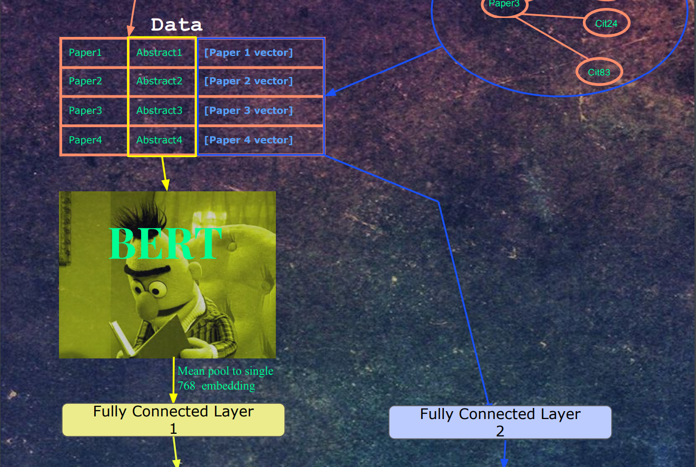
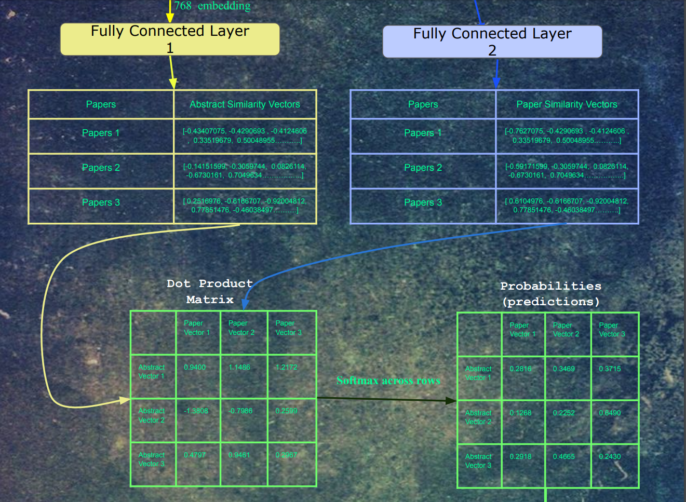
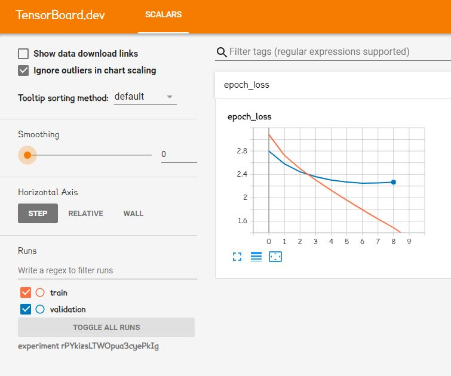
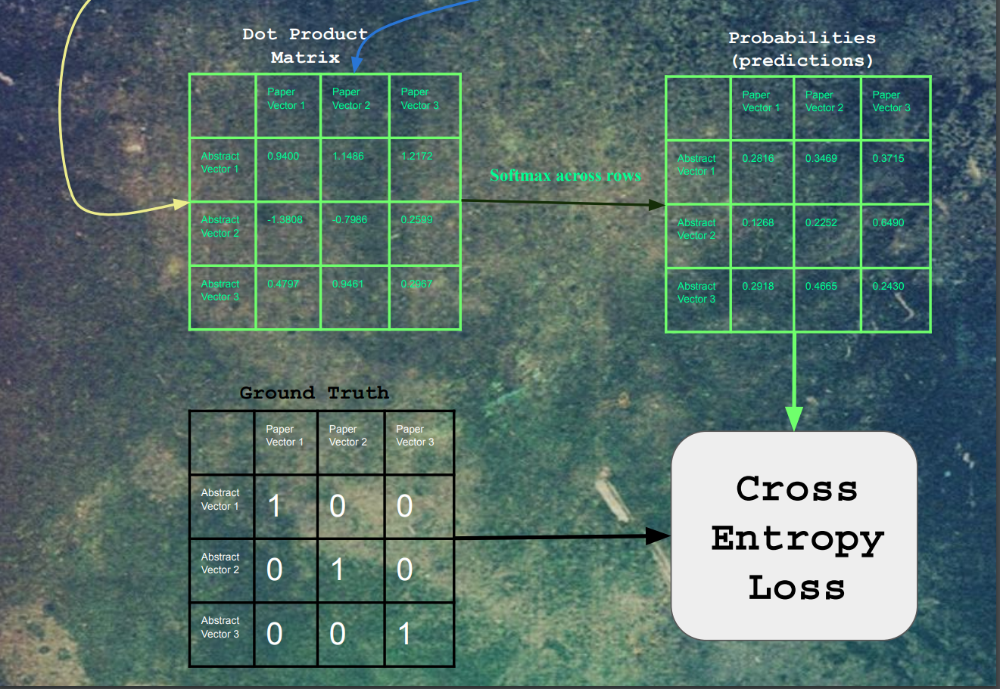
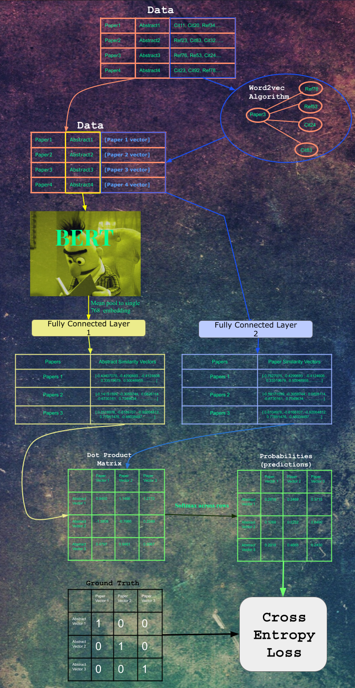

[](http://hits.dwyl.io/Santosh-Gupta/NaturalLanguageRecommendations)

# Natural Language Recommendations: A novel research paper search engine developed entirely with embedding and transformer models. 

<p align="center">
  
</p>

## Try it out, NOW

https://colab.research.google.com/github/Santosh-Gupta/NaturalLanguageRecommendations/blob/master/notebooks/inference/DemoNaturalLanguageRecommendationsCPU_Autofeedback.ipynb

Run the first cell of the colab notebook to download and load the models and data. There there's about 8 gigs total to download and load in the first cell, so this cell will take several minutes to run. After it has finished running, it'll be ready to take your queries. 

The model was trained on abstracts for input, so it does the best on inputs of ~100 words, but does pretty well on short 1-sentence queries as well. 

Note: The Colab notebook above automatically and anonymously records queries, which will be used to improve future versions of our model. If you do not wish to send queries automatically, use this version, which will only send feedback manually:

https://colab.research.google.com/github/Santosh-Gupta/NaturalLanguageRecommendations/blob/master/notebooks/inference/DemoNaturalLanguageRecommendationsCPU_Manualfeedback.ipynb

<p align="center">
  
</p>

Results include title, abstract, and Semantic Scholar link to the paper. 

## Architecture 

<p align="center">
  
</p>

The architecture is one part word2vec, one part Bert as a text encoder. I previously explored Bert medical text encodings in a previous project [https://github.com/re-search/DocProduct] and was impressed by the effectiveness of correlating medical questions with answers. In this project, we use the abstract of each paper as the input, but instead of using another Bert encoding as a label, we use a vector that was trained using word2vec. The Semantic Scholar Corpus [https://api.semanticscholar.org/corpus/] contains 179 million papers, and for each paper, it has the paper IDs of papers that it either cited or papers that referenced that paper. 

This network of citations can be trained in using the word2vec algorithm. Each embedding represents a paper. For each paper, it's citations and embeddings act as the 'context'. 


<p align="center">
  
</p>

Our word2vec training notebooks can be found here https://github.com/Santosh-Gupta/NaturalLanguageRecommendations/tree/master/notebooks/training

Next, the abstracts are fed into Bert. The embeddings for the last hidden layer and mean pooled into a single 768-dimensional vector. This vector and then fed into a fully connected layer, whose output is a 512-dimensional vector. At the same time, each paper's paper vector is fed into a separate fully connected layer, whose output is 512 dimensions. We picked 512 as the embedding size in word2vec because in the literature on word embeddings, sometimes the embedding quality decreases after 512 dimensions, so we picked the highest dimension possible (to closer to Bert's 768 hidden layer dimensions) without risk of decreasing the quality of the embeddings. There isn't too much confidence in this choice, as the distributions in the paper data are quite different from words in text. Regular word2vec training contains 5-6 figures of labels, a lot of which frequently occur throughout the data. The paper data has  7-8 figures of labels, which each label occurring much less frequently. 


<p align="center">
  
</p>

The notebook that we used to convert the abstracts to bert input ids, and make a dataset with the input ids and paper vectors to tfrecords files can be found here: 

https://github.com/Santosh-Gupta/NaturalLanguageRecommendations/blob/master/notebooks/data/CreateCS_tfrecordsDataSet4Bert_github.ipynb

We wanted to use negative sampling in our training, so in each batch, all of the labels can act as negative labels for training examples that they do not belong to. This is tricky to do because we wanted the samples to be chosen at random, but our data was split up into multiple files, with only a few at a time being loaded into memory due to our dataset being too large to fit the whole thing into ram. Luckily, the tf.data API made this easy to do. 

```
with strategy.scope():
    train_files = tf.data.Dataset.list_files(tfrecords_pattern_train)
    train_dataset = train_files.interleave(tf.data.TFRecordDataset,
                                           cycle_length=32,
                                           block_length=4,
                                           num_parallel_calls=autotune)
    train_dataset = train_dataset.map(parse_example, num_parallel_calls=autotune)
    train_dataset = train_dataset.batch(batch_size, drop_remainder=True)
    train_dataset = train_dataset.repeat()
    train_dataset = train_dataset.prefetch(autotune)

    val_files = tf.data.Dataset.list_files(tfrecords_pattern_val)
    val_dataset = val_files.interleave(tf.data.TFRecordDataset,
                                       cycle_length=32,
                                       block_length=4,
                                       num_parallel_calls=autotune)
    val_dataset = val_dataset.map(parse_example, num_parallel_calls=autotune)
    val_dataset = val_dataset.batch(batch_size, drop_remainder=True)
    val_dataset = val_dataset.repeat()
    val_dataset = val_dataset.prefetch(autotune)

```

<p align="center">
  
</p>

Another challenge we ran into is the training time for the data. We were developing this project for the TFWorld hackathon [https://tfworld.devpost.com/] whose deadline was Dec 31st, but we had only finished processing the data a few days before. We had 1.26 million training example, and our architecture contained a whole Bert model, which is *not super fast to train on*. Luckily, we had access to TPUs, which were ultrafast; **1 epoch taking 20-30 minutes each!** Not only were we able to complete training on the data, but we were also able to run several hyperparameter experiments on the data before the deadline. 

```
try:
    tpu = tf.distribute.cluster_resolver.TPUClusterResolver('srihari-1-tpu')  # TPU detection
    print('Running on TPU ', tpu.cluster_spec().as_dict()['worker'])
except ValueError:
    tpu = None

if tpu:
    tf.config.experimental_connect_to_cluster(tpu)
    tf.tpu.experimental.initialize_tpu_system(tpu)
    strategy = tf.distribute.experimental.TPUStrategy(tpu)
```

```
with strategy.scope():
    train_files = tf.data.Dataset.list_files(tfrecords_pattern_train)
    train_dataset = train_files.interleave(tf.data.TFRecordDataset,
                                           cycle_length=32,
                                           block_length=4,
                                           num_parallel_calls=autotune)
    train_dataset = train_dataset.map(parse_example, num_parallel_calls=autotune)
    train_dataset = train_dataset.batch(batch_size, drop_remainder=True)
    train_dataset = train_dataset.repeat()
    train_dataset = train_dataset.prefetch(autotune)

    val_files = tf.data.Dataset.list_files(tfrecords_pattern_val)
    val_dataset = val_files.interleave(tf.data.TFRecordDataset,
                                       cycle_length=32,
                                       block_length=4,
                                       num_parallel_calls=autotune)
    val_dataset = val_dataset.map(parse_example, num_parallel_calls=autotune)
    val_dataset = val_dataset.batch(batch_size, drop_remainder=True)
    val_dataset = val_dataset.repeat()
    val_dataset = val_dataset.prefetch(autotune)```
```

```
with strategy.scope():
    model = create_model(drop_out=0.20)
    model.compile(loss=loss_fn,
                  optimizer=tf.keras.optimizers.Adam(learning_rate=3e-5))
```


The really fun part was using Tensorboard, which allows users to see training and results in real-time. 

https://tensorboard.dev/experiment/rPYkizsLTWOpua3cyePkIg/#scalars

https://tensorboard.dev/experiment/dE1MpRHvSd2XMltMrwqbeA/#scalars

<p align="center">
  
</p>

A link to the model training notebook can be found here 

https://github.com/Santosh-Gupta/NaturalLanguageRecommendations/blob/master/notebooks/training/model.ipynb

Watching the first Tensorboard training was like watching a NASA launch. At the time of the first training, we spent nearly 2 months on the project. There was some worry that the data may not train well. There may have been something wrong with the data (which occurred the first time we trained word2vec). Maybe we picked the wrong hyperparameters, etc. We all sat around, nervously waiting for each 20-minute epoch increment, hoping the validation loss would go down. **And then it did.** And then it did again, and again. And again. 

After the embeddings pass through the fully connected layers, the resulting embeddings are all dot product'd with each other. For each paper, a softmax was taken for each of its dot products. Finally, the cross-entropy loss was calculated on these logits, with a label of 1 for each original input/output pair for that training example, and 0 for all other combinations. 

<p align="center">
  
</p>

Putting it all together

<p align="center">
  
</p>

## Paper Data
The papers used for this project were cleaned from Semantic Scholar's Open Corpus. 
Link to the cleaned data used: https://drive.google.com/open?id=1PcdLDJUXoVXorlCTcGlM98GllArk5Z9s

## Motivation

Scientific information retrieval has been my biggest fascination for several years now (and now some our members share the same interest!), and it started with my research positions in biomedical research, where one of the greatest areas of friction was the difficulty in finding all the research that was relevant to my projects. This is a very common issue with researchers, especially in chem/bio/medical research due to the huge variations in terms and phrasing.

To CS people, I use this example to describe what it’s like searching for information in chem/bio: imagine that StackOverflow doesn’t exist, and there’s no unified documentation for any platform, framework, or library; and all the available documentation has variation in terminology and phrasing. Imagine how slow development is in these circumstances. Imagine what the state of the internet, software, the hardware would be under these circumstances. That’s the type of friction that research in chemistry and biology is dealing with right now; the world is missing out on a ton of amazing scientific progress because of this friction.

There were many times where I would stumble upon a very relevant paper, months after I had completed a project it was relevant to. Not only does this type of friction slow down research, but it also stifles creativity and the imagination towards the goals these researchers have.

The latest advancements in NLP has the potential to significantly reduce this sort of friction. Vector representation of queries and documents reduces the dependency of a particular keyword or phrase for robust information retrieval. The vector representation is already being implemented into information retrieval systems at the highest levels; Earlier this year, Google announced that it is incorporating Bert into its main search engine, affecting up 10% of all search results.

I think the potential for significant acceleration of scientific research makes this field an area very much worth pursuing. I have seen directly what the world is missing out on, and I suggest to anyone who looking for a particular focus in NLP, to consider scientific information retrieval. But you don't have to take my word for it, in 2017 IBM Watson found 96 cases of relevant treatment options in patients that doctors had overlooked [https://bigthink.com/stephen-johnson/ibms-watson-supercomputer-found-treatments-for-323-cancer-patients-that-human-experts-overlooked]

I feel that its important to pursue as many varied information retrieval techniques/models as possible. Although many of these models will overlap, the most import aspect is if a model can find papers that the other models left behind. This becomes increasingly important for very difficult topics to search for. And often, 1 paper can have a huge impact on the direction of a project.

For the Semantic Scholar Corpus, we found a very unique way of modeling information retrieval. The corpus has citation network data, and abstracts. We were able to correlate text encodings to the citation networks.

## Our Amazing Chaotic Journey (How we did it)

#### Step 1: Filter the Semantic Scholar Corpus

The Semantic Scholar Corpus contains about 178 million papers in a variety of subjects. We don't have the computer power to process the whole dataset (yet, if you know anything about model parallelism, please contact us), so we're focusing on subsets of the corpus. 

We developed filters to distill CS/Math/Physics papers from the corpus here (warning, huge notebook)

https://github.com/Santosh-Gupta/NaturalLanguageRecommendations/blob/master/notebooks/text2cite_preprocessing.ipynb

And we are currently working on a subset that contains only Medline/Pubmed papers

https://github.com/Santosh-Gupta/NaturalLanguageRecommendations/blob/master/notebooks/data/medical_preprocessing.ipynb

Our filtering isn't perfect, there are papers that shouldn't be in our subsets.

#### Step 2: Pruning, and creating embeddings dataset

Each paper has a list of references and citations. We only want papers that have citations or references to one of the other papers in our dataset (otherwise its embedding will never get a chance to be trained in word2vec), so we prune out those papers. Next, we map a unique embedding ID for each paper, save the citation data, and create an HDF5 dataset to be used for word2vec training. 

https://github.com/Santosh-Gupta/NaturalLanguageRecommendations/blob/master/notebooks/data/PruningCreateEmbeddingDataGithub.ipynb

#### Step 3: Word2vec

We apply word2vec training to the citation/reference network data. The 'context' for each paper will be 4 of its reference/citation papers chosen at random. The issue with training an embedding for each paper is that we have a lot of papers. Our CS dataset contains 1.26 million papers (whereas word embedding training is usually in 5-6 figures only), and our Medline/Pubmed dataset contains 15 million papers. 

We were looking into model parallelism at the time, but with the deadline coming up, we decided to use SpeedTorch. Although we still have a TF2.0 version of Word2Vec implemented in Keras, [here](https://github.com/Santosh-Gupta/NaturalLanguageRecommendations/blob/master/notebooks/training/TF2.0%20Word2Vec%20CBOW.ipynb).

https://github.com/Santosh-Gupta/SpeedTorch

A library to increase transfer between CPU<->GPU. We used this to host some of the embeddings on the CPU whenever they weren't being trained. 

https://github.com/Santosh-Gupta/NaturalLanguageRecommendations/blob/master/notebooks/training/PaperVectorTrainingWord2vec_Github.ipynb

#### Step 4: Create the Bert Dataset.

After word2vec training, we have a citation embedding which represents each paper. We can then use this vector as a label for the mean-pooled output of the last hidden states of Bert, with the input being each paper's abstract. We used the SciBert vocab for the tokenizer since SciBert was trained on many of the papers in the Semantic Scholar Corpus. 

https://github.com/allenai/scibert

https://github.com/Santosh-Gupta/NaturalLanguageRecommendations/blob/master/notebooks/data/CreateCS_tfrecordsDataSet4Bert_github.ipynb

We saved these files as the tfrecords, which works great with the tf.data API and TPU training. 

https://www.tensorflow.org/tutorials/load_data/tfrecord

#### Step 5: Training Bert

Using the dataset created in Step 4, we can train our Bert model and our similarity fully connected layers. Please see the architecture section for more details. We used the TF2.0 Keras version of HuggingFace's transformer library for Bert. 

https://github.com/huggingface/transformers

And we used Keras for the overall architecture as well. The initial weights we used were SciBert weights. https://github.com/allenai/scibert. 

We used tf.data to handle our data pipeline, and we used TPUv3-8 provided by the TensorFlow Research Cloud to train over our data.

https://github.com/Santosh-Gupta/NaturalLanguageRecommendations/blob/master/notebooks/training/model.ipynb

#### Step 6: Inference

At inference, a user inputs text that will be converted by our model into a test similarity vector (through Bert and its fully connected layer), and a similarity search will be performed against all of our papers' citation similarity vectors. While testing the embeddings, we found out that the abstract similarity vectors also give great results, so we decided to search against both and return the results. 

Our simple inference notebook can be found here 
https://github.com/Santosh-Gupta/NaturalLanguageRecommendations/blob/master/notebooks/inference/DemoNaturalLanguageRecommendationsSimpleDemoCPU.ipynb

Or, to test directly in colab:

https://colab.research.google.com/github/Santosh-Gupta/NaturalLanguageRecommendations/blob/master/notebooks/inference/DemoNaturalLanguageRecommendationsCPU_Autofeedback.ipynb

The notebook Above uses colab forms to hide most of the code, you can double click on any of the cell boxes to see the code. The inference runs on a CPU. 

For those who would like to test out inference on a GPU or even a TPU, the notebook Below automatically detects which type of instance is running at initialization, and sets the workers accordingly. 

https://github.com/Santosh-Gupta/NaturalLanguageRecommendations/blob/master/notebooks/inference/build_index_and_search.ipynb

Colab verison:

https://colab.research.google.com/github/Santosh-Gupta/NaturalLanguageRecommendations/blob/master/notebooks/inference/build_index_and_search.ipynb

If you like using TPUs to perform similarity search, we created a library just for this (we predict are group is going to need to do this, alot). Here is a notebook which incorporated our library TPU-Index, for similarity search. 

https://colab.research.google.com/drive/1wkrilS34nC4kBNEPA1bT0GOJJ8-NRzfJ

## Side Quest 

<p align="center">
  
</p>

<p align="center">
  <b>Ultrafast indexing, powered by TPUs</b>
</p>

We plan to eventually run inference on all 179 million papers on the Semantic Scholar Corpus, each which will have a 512-dimensional vector, which is a ton of papers to run similarity search on.  This can be a very computational resource and time-consuming. There are libraries for this, like Faiss, but as we were getting to know how to utilize TPUs, Srihari came up with an idea of running cos similarity indexing over TPUs; and he created a new library for this!

```
!pip install tpu-index

```

```
from tpu_index import TPUIndex

index = TPUIndex(num_tpu_cores=8)
index.create_index(vectors)  # vectors = numpy array, shape == [None, None]

...
D, I = index.search(xq, distance_metric='cosine', top_k=5)
```

We chose to do this on TPUs for their speed and memory capacity.  Currently, the package supports search using cosine similarity, but we plan to extend this to multiple distance metrics. 

Currently, Google Colab has v2-8 TPUs, which have 8 gigs per core (64 gigs total). This instance can handle about 19 to 22 million float32 embeddings of size 512 (this seems to vary among depending on what chunk size we use to append the vectors, we can't pin point why). **For 19.5 million embeddings, it takes 1.017 seconds for a single cos similarity search.** 

We recommend adding embeddings of this size in chunks of 750,000, otherwise a memory error could occur. While appending the vectors. We find that smaller chunk sizes may result in a larger number of vectors that the index can hold. 

The package is quite simple to use, check it out: 

https://github.com/srihari-humbarwadi/tpu_index

https://pypi.org/project/tpu-index/

https://github.com/Santosh-Gupta/NaturalLanguageRecommendations/blob/master/notebooks/inference/TpuIndex_build_index_and_search.ipynb

https://github.com/Santosh-Gupta/NaturalLanguageRecommendations/blob/master/notebooks/inference/tpu_index_search_million_embeddings.ipynb

Test it out with our Colab Notebooks 

Test our model
https://colab.research.google.com/drive/1wkrilS34nC4kBNEPA1bT0GOJJ8-NRzfJ

Demo of a cos similarity search on 19.5 million float32 embeddings of size 512; average search time 1.017 seconds. 
https://colab.research.google.com/drive/1ULxK5esPJVvy7BmQx8j_6koGLMzVEDLy

## Case Studies (More coming soon)

One of the main motivations of this project is to find papers that are highly relevant to a search query. We'll be testing the model out in the next couple weeks, and will post interesting case studies here. 

### Case 1

It was recently found by one of our members a perfect example of how our solution compares to an established one such the Semantic Sholar Corpus. For this [paper](https://www.semanticscholar.org/paper/Job-Prediction%3A-From-Deep-Neural-Network-Models-to-Huynh-Nguyen/f96cae24d992d7bcd44a99baa2ecd80e713271cc#related-papers). Titled: Job Prediction: From Deep Neural Network Models to Applications
Which the Sematic Scholar gives these three papers as 'Relevant Papers':

<p align="center">
  
</p>

And our model was able to find:
<p align="center">
  
</p>

Although our model also shows non-relevant results to using machine learning in job matching and modeling this does show the capabilities of our model in being able to find rarer or more obscure papers that have fewer academic papers written on the subject.

### Case 2

query = 'job prediction with machine learning'

---Top 5 results for Semantic Scholar--- 

https://www.semanticscholar.org/search?q=job%20prediction%20with%20machine%20learning&sort=relevance

Introduction to machine learning https://www.semanticscholar.org/paper/Introduction-to-machine-learning-Alpaydin/0359bba5112d472206d82ddb29947f2d634bb0cc

Large-Scale Machine Learning with Stochastic Gradient Descent https://www.semanticscholar.org/paper/Large-Scale-Machine-Learning-with-Stochastic-Bottou/fbc6562814e08e416e28a268ce7beeaa3d0708c8

Link prediction using supervised learning https://www.semanticscholar.org/paper/Link-prediction-using-supervised-learning-Hasan-Chaoji/413240adfbcb801b5eb186b8a9e67fe77588733c

Gaussian processes for machine learning https://www.semanticscholar.org/paper/Gaussian-processes-for-machine-learning-Rasmussen-Williams/82266f6103bade9005ec555ed06ba20b5210ff22

Applications of Machine Learning in Cancer Prediction and Prognosis https://www.semanticscholar.org/paper/Applications-of-Machine-Learning-in-Cancer-and-Cruz-Wishart/7e7b9f37ce280787075046727efbaf9b5a390729

---Top results for Natural Language Recommendations--- 

Using abstract similarity: 

Bejo: Behavior Based Job Classification for Resource Consumption Prediction in the Cloud https://www.semanticscholar.org/paper/f6913c1d255f236f7c4e2a810425d33256cf3d84

Random Forest Forecast (RFF): One hour ahead jobs in volunteer grid https://www.semanticscholar.org/paper/c770ccd5ae0809139bc13cc82356f0b132c24433

Analysis of XDMoD/SUPReMM Data Using Machine Learning Techniques https://www.semanticscholar.org/paper/09af1a0185955c3aea1692972296c697f0c5b7ee

Job Recommendation System based on Machine Learning and Data Mining Techniques using RESTful API and Android IDE https://www.semanticscholar.org/paper/fe661340e332779f8c40dca713011f0fad938688

Machine Learning Based Prediction and Classification of Computational Jobs in Cloud Computing Centers https://www.semanticscholar.org/paper/e1b11d29b7bba8b6048439ebbb8ee26700d702a1

Using citation similarity (these results aren't as good; citation similarity only seems to do well with longer inputs, 100+ words):

A signal processing method to eliminate grating lobes https://www.semanticscholar.org/paper/0bc3f599347ae37b530b79e7e7458dca8208aef1

Multi- and Single-output Support Vector Regression for Spectral Reflectance Recovery https://www.semanticscholar.org/paper/c6e0cbbee2745650823407d2237e511fea6578c7

Space-vector PWM voltage control with optimized switching strategy https://www.semanticscholar.org/paper/795e517f8951daefc920fbec291261374dc9ee14

Pole position problem for Meixner filters
https://www.semanticscholar.org/paper/179a4bf74953c5111abd4de1f31e0f163d48fd22

### Case 3

query = 'Optimal negative sampling for embedding models. What is the ratio of negative samples to positive examples results in the best quality vectors in noise contrastive estimation.'

---Top 5 results for Semantic Scholar (CS results only)---

https://www.semanticscholar.org/search?q=Optimal%20negative%20sampling%20for%20embedding%20models.%20What%20is%20the%20ratio%20of%20negative%20samples%20to%20positive%20examples%20results%20in%20the%20best%20quality%20vectors%20in%20noise%20contrastive%20estimation.&sort=relevance

Toward Optimal Active Learning through Sampling Estimation of Error Reduction https://www.semanticscholar.org/paper/Toward-Optimal-Active-Learning-through-Sampling-of-Roy-McCallum/0a20a309deda54fe14580007759c9c7623c58694

Sampling-based algorithms for optimal motion planning https://www.semanticscholar.org/paper/Sampling-based-algorithms-for-optimal-motion-Karaman-Frazzoli/4326d7e9933c77ff9dc53056c62ef6712d90c633

Large sample estimation and hypothesis testing https://www.semanticscholar.org/paper/Large-sample-estimation-and-hypothesis-testing-Newey-Mcfadden/3ff91f28967e0702667a644f8f9c53d964d63e4c

Negative Binomial Regression https://www.semanticscholar.org/paper/Negative-Binomial-Regression-Hilbe/e54fdd22ca9d6c1094db3c0de18b3f184734dd23

A transformation for ordering multispectral data in terms of image quality with implications for noise removal https://www.semanticscholar.org/paper/A-transformation-for-ordering-multispectral-data-in-Green-Berman/6ae00ebd3a91c0667c79c39035b5163025bcfcad

---Top results for Natural Language Recommendations--- 

Using abstract similarity: 

Biparti Majority Learning with Tensors https://www.semanticscholar.org/paper/0985d86afbfcd53462f59bd26dd03505c9c09395

Linear discriminant analysis with an information divergence criterion https://www.semanticscholar.org/paper/1f73769d98a1c661d4ce3877a25d558ef93f66bf

One-class label propagation using local cone based similarity https://www.semanticscholar.org/paper/7e0c82b3225a12752dd1062292297b6201ca8d6e

Concave Region Partitioning with a Greedy Strategy on Imbalanced Points https://www.semanticscholar.org/paper/d5bfdac67aec2940c93327bcf5d6e7ee86a70b64

Noise-Contrastive Estimation Based on Relative Neighbour Sampling for Unsupervised Image Embedding Learning
https://www.semanticscholar.org/paper/9b87f58b620d9de5f360f6dccdcedfffd99c1408

Using citation similarity:

Learning from Imbalanced Data https://www.semanticscholar.org/paper/6a97303b92477d95d1e6acf7b443ebe19a6beb60

Bregman Divergence-Based Regularization for Transfer Subspace Learning https://www.semanticscholar.org/paper/4118b4fc7d61068b9b448fd499876d139baeec81

The pyramid match kernel: discriminative classification with sets of image features https://www.semanticscholar.org/paper/625bce34ec80d29242340400d916e799d2975430

Linear Discriminative Sparsity Preserving Projections for Dimensionality Reduction https://www.semanticscholar.org/paper/13e677e2041e688a2b33391f21c163e042e097d9

Transfer Sparse Coding for Robust Image Representation https://www.semanticscholar.org/paper/afe14b9034f71c7078cd03626853170ef51b8060

### Case 4

query = 'Copula Density Estimation'

-Top 5 results for Semantic Scholar.

https://www.semanticscholar.org/search?q=Copula%20Density%20Estimation&sort=relevance

Copula Methods in Finance https://www.semanticscholar.org/paper/Copula-Methods-in-Finance-Cherubini-Luciano/f5a07d110482abf5bb537b37d414737d114afa09

Autoregressive Conditional Density Estimation https://www.semanticscholar.org/paper/Autoregressive-Conditional-Density-Estimation-Hansen/c474cc43d8294ef7340f615a429f5085df624051

Kernel density estimation via diffusion https://www.semanticscholar.org/paper/Bayesian-Density-Estimation-and-Inference-Using-Escobar-West/df25adb36860c1ad9edaac04b8855a2f19e79c5b

Bayesian Density Estimation and Inference Using Mixtures https://www.semanticscholar.org/paper/Bayesian-Density-Estimation-and-Inference-Using-Escobar-West/df25adb36860c1ad9edaac04b8855a2f19e79c5b

Pair-copula constructions of multiple dependence https://www.semanticscholar.org/paper/Pair-copula-constructions-of-multiple-dependence-Aas-Czado/817b6512d3d07ae231d525c366f9a95aa9bdc75a

-Top results for Natural Language Recommendations 

Using abstract similarity 

On Necessary Conditions for Dependence Parameters of Minimum and Maximum Value Distributions Based on n-Variate FGM Copula https://www.semanticscholar.org/paper/ac2a2521904ca20d1135370581fdc84fbb79e46d

Conditional Mean and Conditional Variance for Ali-Mikhail-Hap Copula https://www.semanticscholar.org/paper/ed09d9d721a63ca2d2fa5fac945f1e8e96b7b429

Efficient estimation of high-dimensional multivariate normal copula models with discrete spatial responses https://www.semanticscholar.org/paper/f09557729a65cd87b8bbfd0950125063e06b97da

Nonparametric estimation of simplified vine copula models: comparison of methods https://www.semanticscholar.org/paper/3e41b0e69342f71ff33791b88eb741c265c1eabf

On tests of radial symmetry for bivariate copulas https://www.semanticscholar.org/paper/f22539174a7915b68092f27c6b6bc3c91f1fa1b0

Using citation similarity

None of the results using citation similarity were relevant. Again, it doesn't do well unless the queries are over 100 words. 


## Unfinished Business (future work)

#### Metrics

Judging the results just qualitatively. . . they're really really *Really* Good. (But don't take our word for it, try it out. We have [colab notebooks](https://github.com/Santosh-Gupta/NaturalLanguageRecommendations/tree/master/notebooks/inference) that downloads the model and the data within a few clicks, and you can use it to search papers in CS). We are looking for ways to give our qualitative experiences of quantitative metrics. If you have any ideas, please contact us at Research2vec@gmail.com.

#### Model Variations 

We have gained quite a bit of insight during this project, and have ideas of what may further improve the quality of the results. We have quite a few ideas on variations on our model which we are curious to test out. 

#### Bigger/Better Subsets

Since the Semantic Scholar corpus is so large, we can only test subsets of subjects at a time, but there's not a way currently to filter out a certain subset directly, so we have to get creative on how we create our subsets. We are hoping to improve upon our filtering methods to get more specific/accurate subsets from the corpus. 

We are also hoping to figure out ways to increase the number of parameters we can train word2vec on. Currently, our capacity is around 15 million. We are aiming to get up to 179 million, which would take up a ton of memory (200 gb?) to have them all loaded into memory at the same time. If you have any ideas for this, please get in touch. 

#### Paper

We are also looking to perform experiments and write up our work in a high enough level of quality that would make a significant contribution to the field of NLP, and thus qualify for getting accepted into a prestigious venue/journal. We are also looking for mentors who have accomplished this. If interested, please contact us at the email posted above.

## File Descriptions 

### Notebooks

#### [build_index_and_search.ipynb](https://github.com/Santosh-Gupta/NaturalLanguageRecommendations/blob/master/notebooks/inference/build_index_and_search.ipynb)
Description: This notebook loads the trained bert model, builds the index with 1.3 million papers on TPUs and runs a demo search.

#### [tpu_index_search_million_embeddings.ipynb](https://github.com/Santosh-Gupta/NaturalLanguageRecommendations/blob/master/notebooks/inference/tpu_index_search_million_embeddings.ipynb)
Description: A demo notebook showcasing our tpu_index package running search on a million abstract embeddings from BERT model.

#### [create_abstract_vectors.ipynb](https://github.com/Santosh-Gupta/NaturalLanguageRecommendations/blob/master/notebooks/inference/create_abstract_vectors.ipynb)
Description: This notebook extracts embeddings for paper abstracts by passing them through the BERT model.

#### [inference_model.ipynb](https://github.com/Santosh-Gupta/NaturalLanguageRecommendations/blob/master/notebooks/inference/build_index_and_search.ipynb)
Description: This notebook builds the models for inference phase.

#### [medical_preprocessing.ipynb](https://github.com/Santosh-Gupta/NaturalLanguageRecommendations/blob/master/notebooks/data/medical_preprocessing.ipynb)
Description: This notebook was used to clean the original Open Corpus dataset to retain all papers that either had a PubMed id or were part of MedLine and had at least 1 citation. Cleaned medical data in the folder linked above.

#### [model.ipynb](https://github.com/Santosh-Gupta/NaturalLanguageRecommendations/blob/master/notebooks/training/model.ipynb)
Description: This notebook has the training code for BERT, which is designed to run on Google Cloud TPU v3-8.

#### [pruning_first_pass.ipynb](https://github.com/Santosh-Gupta/NaturalLanguageRecommendations/blob/master/notebooks/data/pruning_first_pass.ipynb)
Description: This notebook pruned our filtered data, meaning that it only kept papers in the cleaned dataset that either had a citation to or were cited by another paper in the cleaned data. Pruned data in the folder linked above.

#### [text2cite_preprocessing.ipynb](https://github.com/Santosh-Gupta/NaturalLanguageRecommendations/blob/master/notebooks/text2cite_preprocessing.ipynb)
Description: This notebook was used to clean the original Open Corpus data to only keep papers related to fields such as engineering, math, physics, and CS. Medical/humanities papers were filtered out. Cleaned CS data in the folder linked above.

#### [tfrecords_debug.ipynb](https://github.com/Santosh-Gupta/NaturalLanguageRecommendations/blob/master/notebooks/tfrecords_debug.ipynb)
Description: Testing the tfrecord writer class.

#### [TF2.0 Word2Vec CBOW.ipynb](https://github.com/Santosh-Gupta/NaturalLanguageRecommendations/blob/master/notebooks/training/TF2.0%20Word2Vec%20CBOW.ipynb)
Description: The original Word2Vec model implemented in Keras.

### Python files

#### [tfrecordwriter.py](https://github.com/Santosh-Gupta/NaturalLanguageRecommendations/blob/master/src/TFrecordWriter.py)
Description: This file is a TFrecord writer class that has utility functions for sharing the dataset.

#### [model.py](https://github.com/Santosh-Gupta/NaturalLanguageRecommendations/blob/master/notebooks/training/model.ipynb)
Description: This is the training code for the BERT model, which is designed to run on Google Cloud TPU v3-8.

### Packages

#### [tpu_index](https://github.com/srihari-humbarwadi/tpu_index)
Description: TPU Index is a package that we came up with for the community to use for fast similarity search over large collections of high dimension vectors on TPUs.

## Authors 

### Santosh Gupta

Santosh is a former Biomedical Engineer, current Machine Learning Engineer. His favorite area in machine learning is using the latest advancements in NLP for better scientific information retrieval. You can follow him on twitter here https://twitter.com/SantoshStyles

### Akul Vohra

Akul is a junior in high school and is interested in NLP research. He would like to pursue cognitive science or computer science in the future and is happy to be a contributor in Natural Language Recommendations. Here is his portfolio: https://akul.org/

### Liam Croteau

Liam is a Nanotechnology engineering undergraduate student, interested in NLP and machine learning for better scientific information  retrieval. You can follow him on twitter here https://twitter.com/LiamCroteau.


### Srihari Humbarwadi

Srihari is a Computer Vision Engineer, interested in Computer Vision, NLP and machine learning, He is currently working to improve self supervision and data efficient training methods. You can follow him on twitter here https://twitter.com/srihari_rh.

## Questions, Comments, Collaborations, Feedback? 

Research2vec@gmail.com 
